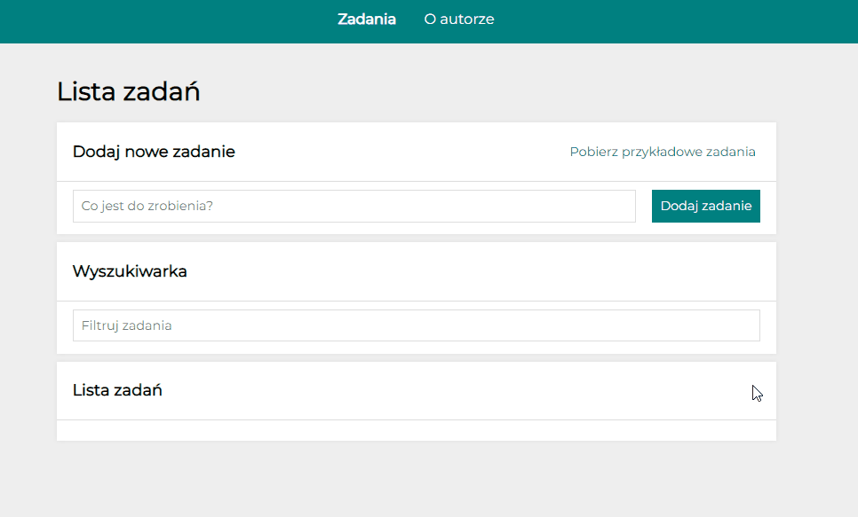

# ToDo-List

This project was bootstrapped with [Create React App](https://github.com/facebook/create-react-app).

## Table of content
1. Demo
1. Preview
1. Description
1. Technologies
1. Getting started

## DEMO
[ToDo-List-React Demo](https://adriansacha.github.io/todo-list-react/)

## PREVIEW

## Description

1. In the `Co jest do zrobienia?` input area write down what you want to add to the list
2. Press the `Dodaj zadanie` button
3. Your list item is below in `Lista zadań` section
4. You can mark your list item as done by *left button* (checked icon)
5. You can delete your list item by *Right button* (trash icon)
6. You can mark all list items as done by button `Ukończ wszystkie`
7. You can hide all marked as done items by button `Ukryj zakończone`
8. You can show all marked as done items by button `Pokaż ukończone`

## Technologies
- HTML
- BEM
- CSS
- Flex
- Grid
- Transition
- Media query
- Animations
- JS/ES6+
- Immiutability
- Babel
- React
- React-Redux
- React-Router
- Styled Components
- useState
- useEffect
- useRef
- GlobalStyles & Theme

## Available Scripts
In the project directory, you can run:

### `npm start`
Runs the app in the development mode.\
Open [http://localhost:3000](http://localhost:3000) to view it in your browser.

The page will reload when you make changes.\
You may also see any lint errors in the console.

### `npm run build`
Builds the app for production to the `build` folder.\
It correctly bundles React in production mode and optimizes the build for the best performance.

The build is minified and the filenames include the hashes.\
Your app is ready to be deployed!

See the section about [deployment](https://facebook.github.io/create-react-app/docs/deployment) for more information.
